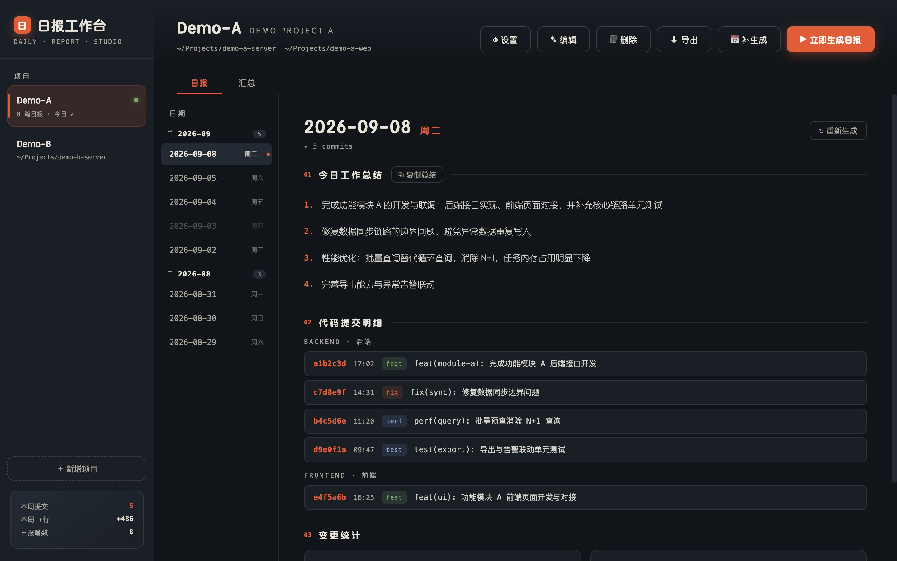
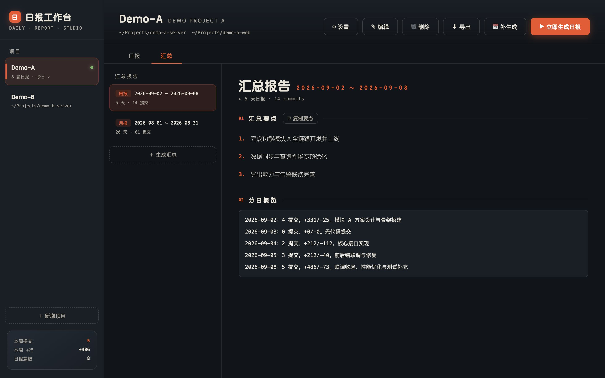
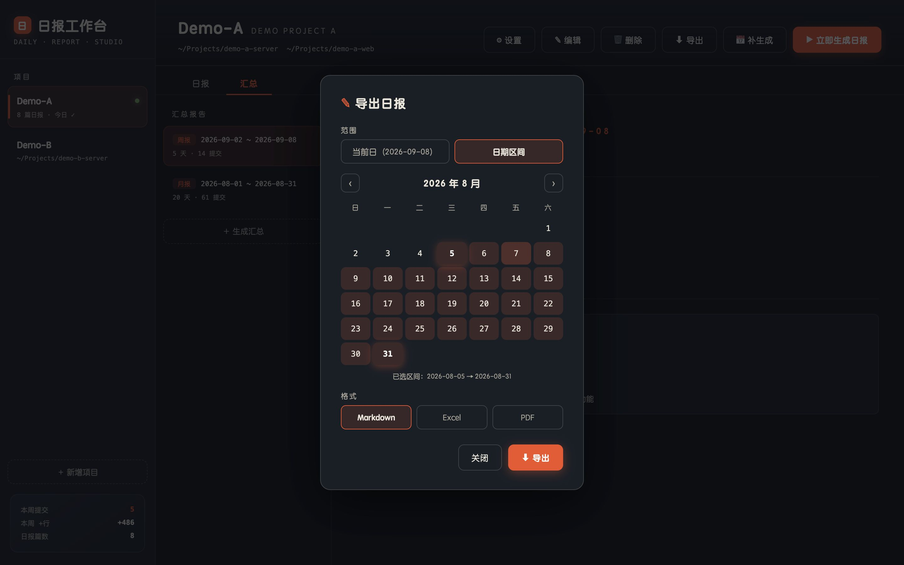
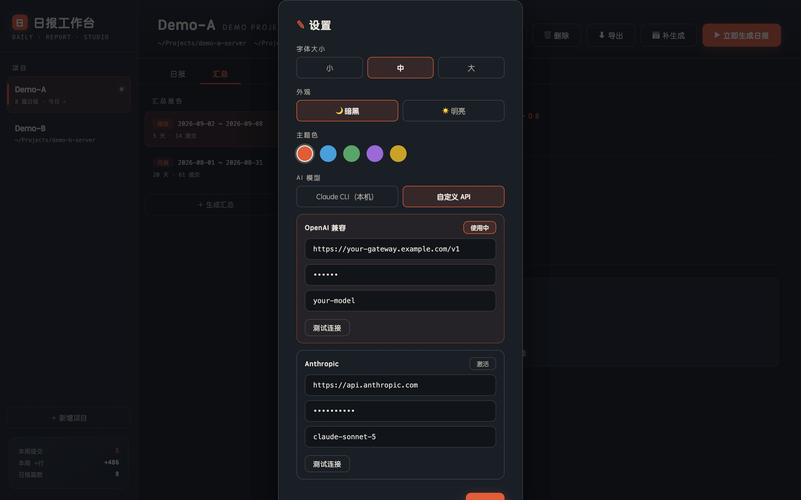

# 日报工作台 · Daily Report Studio

一个本地运行的桌面应用：自动从 Git 仓库采集你的每日提交，借助 AI 归纳为可读的工作日报与周报/月报，支持浏览、补生成、汇总、导出。从「翻 Markdown 文件」到「一键生成周报」。



## 功能特性

### 📅 日报

- **一键生成**：采集当天前后端仓库提交（作者过滤、排除 merge、变更统计），AI 归纳为 2~6 条要点
- **生成过程弹窗**：流式执行日志 + 状态徽标，失败可重试、可重新生成
- **补生成**：日历选择任意历史日期补漏（已生成/未来日期置灰）
- **强制重新生成**：生成成功后才覆盖旧版，失败保留原数据
- **时间轴浏览**：按月份分组折叠，feat/fix 标签着色，总结一键复制

### 📊 汇总报告（周报/月报）

- 快捷区间（周报=近 7 天 / 月报=本月）或自定义日历范围
- 把区间内各天日报交给 AI 按主题归纳为汇报要点，附分日概览
- 生成前实时提示缺失日期（可跳过），同区间重复生成自动替换
- 要点一键复制，写周报直接粘贴



### 📤 导出

- 单日或日期区间导出为 **Markdown / Excel / PDF**
- 区间选择用日历两次点击定范围，已选区间高亮
- Excel 含「总结」「提交明细」双 Sheet；PDF 为排版打印版



### 🔌 AI 生成器三通道

- **Claude CLI**（默认，零配置）：调用本机 `claude -p`
- **OpenAI 兼容 API**：配 URL / Key / 模型 ID 即可接入任意兼容网关（DeepSeek、GLM、通义、OneAPI 等）
- **Anthropic API**：`/v1/messages` 协议
- OpenAI / Anthropic 两组配置**并存**，激活哪个用哪个；每张配置卡片独立「测试连接」

### 🎨 个性化

- 暗黑 / 明亮主题切换，5 色主题色预设，三档字体大小，实时预览、本地持久化



### 🗂 其他

- **多项目管理**：新增/编辑/删除（删除二次确认，级联清理日报）
- **数据本地化**：全部数据存于本地 SQLite，不依赖任何云端服务（AI 调用除外）
- **历史导入**：首次启动自动导入既有 `*_work_report.md` 日报

## 技术栈

| 层 | 选型 |
|---|---|
| 桌面框架 | Electron 33 + electron-vite |
| 前端 | React 18 + TypeScript |
| 数据库 | better-sqlite3（WAL，user_version 版本化迁移） |
| 测试 | Vitest（58 个单测：解析器快照、git fixture、mock LLM、导出内容等） |

## 快速开始

```bash
# 安装依赖（国内网络 Electron 二进制走镜像）
ELECTRON_MIRROR=https://npmmirror.com/mirrors/electron/ npm install

# 按 Electron ABI 重编译原生模块（安装后执行一次）
npx @electron/rebuild -f -w better-sqlite3

# 启动开发模式
npm run dev
```

首次启动会自动 seed 示例项目并导入上级目录的 `*_work_report.md`（如存在）。

## 常用命令

```bash
npm run dev        # 开发模式（热更新）
npm test           # 运行全部单测（58 个）
npm run typecheck  # TypeScript 类型检查
npm run build      # 生产构建
npm run dist       # 打包 macOS dmg（arm64）
```

> 测试通过 `ELECTRON_RUN_AS_NODE=1 electron` 运行 vitest，以匹配 better-sqlite3 的 Electron ABI。

## 打包发版

打包为 macOS dmg 安装包：

```bash
# 国内网络需带 Electron 镜像
ELECTRON_MIRROR=https://npmmirror.com/mirrors/electron/ npm run dist
```

- 产物位于 `dist/日报工作台-<version>-arm64.dmg`，双击即可安装
- 打包过程会自动按 arm64 重编译 better-sqlite3（原生模块），无需手动干预
- 未配置 Apple 开发者证书时会跳过签名，首次打开需在「系统设置 → 隐私与安全性」允许运行
- 发新版本：修改 `package.json` 的 `version` 后重新 `npm run dist`

### 打包 Windows 安装包

在 **Windows 机器**上（需已安装 Node.js 和 Git）：

```bash
# 安装依赖（国内网络 Electron 二进制走镜像）
# PowerShell：$env:ELECTRON_MIRROR="https://npmmirror.com/mirrors/electron/"; npm install
ELECTRON_MIRROR=https://npmmirror.com/mirrors/electron/ npm install

# 按 Electron ABI 重编译原生模块（安装后执行一次）
npx @electron/rebuild -f -w better-sqlite3

# 打包 NSIS 安装包（x64）
ELECTRON_MIRROR=https://npmmirror.com/mirrors/electron/ npx electron-vite build && npx electron-builder --win
```

- 产物位于 `dist/日报工作台 Setup <version>.exe`（NSIS 安装器，双击安装）
- 未配置 Windows 代码签名证书时会跳过签名，SmartScreen 可能提示「未知发布者」，选择「仍要运行」即可；如需消除提示需购买证书并配置 `win.certificateFile`
- 不建议在 macOS 上交叉打包 Windows（需 Wine 且 better-sqlite3 原生模块需在 Windows 下重编译），推荐直接在 Windows 环境构建或走 CI（如 GitHub Actions `windows-latest`）

其他平台：在 `package.json` 的 `build.mac.target` / `build.win.target` 中调整，或参考 [electron-builder 文档](https://www.electron.build/) 添加 `linux` 配置。

## 项目结构

```
electron/
  main/               # 主进程
    index.ts          # 入口：窗口、服务装配、启动导入
    db.ts / schema.ts # SQLite 初始化与版本化迁移（v1~v5）
    services/
      project.ts      # 项目 CRUD
      report.ts       # 日报读取 / 幂等 upsert / md 导入
      reportParser.ts # Markdown 日报解析器
      git.ts          # git log 采集 + shortstat 统计
      generate.ts     # 日报生成编排（LLM 注入式）
      summary.ts      # 周报/月报聚合生成
      export.ts       # MD / Excel / PDF(HTML) 导出
      llm.ts          # LLM Provider：CLI / OpenAI / Anthropic
  preload/            # contextBridge IPC 白名单
src/                  # React 渲染层
shared/types.ts       # 跨进程共享类型
tests/                # Vitest 单测（含真实 md 快照 fixture）
```

## 数据存储

| 数据 | 位置 |
|---|---|
| 日报 / 汇总 / 项目 / 生成日志 | `~/Library/Application Support/report-studio/report-studio.db`（SQLite） |
| 界面设置（主题/字号） | 同目录 `Local Storage/` |

备份只需拷贝 `report-studio.db`（建议先退出应用）。API Key 仅存本地 SQLite，不进日志、不参与导出。

## 设计文档

- [产品设计](docs/product-design.md)
- [技术设计](docs/tech-design.md)
- [交互原型（HTML）](docs/prototype.html)

## License

MIT
